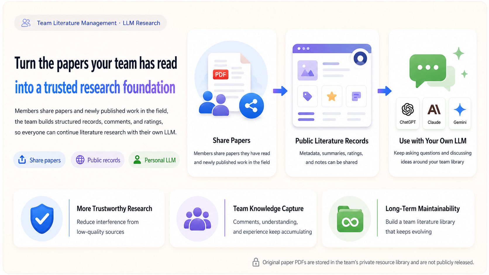
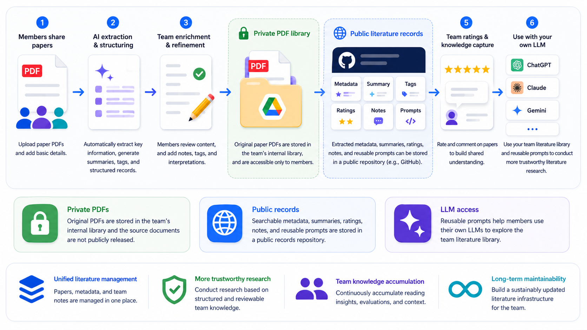

<div align="center">

# Research Literature Hub

### Turn the papers your team has read into a trusted research foundation.

A paper-first workflow for research groups to archive original PDFs, build structured
literature records, capture team judgment, and reuse that knowledge with each member's
own LLM.

[**Live App**](https://research-literature-hub.vercel.app) ·
[**Try Guest Demo**](https://research-literature-hub.vercel.app/login) ·
[**Deployment Guide**](docs/DEPLOYMENT.md) ·
[**中文说明 →**](README.zh-CN.md)

[](https://github.com/yzyzieee/Research-Literature-Hub/actions/workflows/maintain.yml)
[](LICENSE)
[](webapp)
[](webapp)
[](scripts)
[](docs/DEPLOYMENT.md)

</div>



> [!TIP]
> Open the hosted app and choose **Continue as Guest** to explore paper intake,
> extraction, archiving, publishing, reviews, and comments. Guest actions are simulated
> locally: they do not call the configured LLM and do not write to GitHub, Google Drive,
> or team records.

## Why this exists

Research knowledge is usually split across personal folders, reading notes, chat
histories, and repeated LLM conversations. That makes good papers hard to rediscover,
team judgment easy to lose, and literature research unnecessarily repetitive.

Research Literature Hub gives a group one durable workflow:

| Share papers | Build trusted records | Reuse with personal LLMs |
|---|---|---|
| Upload papers that members have read or recently discovered. | Extract metadata and summaries, then add human reviews, ratings, tags, and comments. | Export a catalog, reusable prompt, or selected-paper pack to ChatGPT, Claude, Gemini, Kimi, or another LLM. |

The web app is an **LLM context provider**, not another chatbot. It maintains reliable
literature context while members continue using the LLM subscriptions they already have.

## Two storage destinations

The system deliberately separates original files from public knowledge records:

| Layer | Recommended service | Stores | Access |
|---|---|---|---|
| **Team file storage** | Shared Google Drive folder | Original paper PDFs with normalized filenames | Private or team-controlled |
| **Public record storage** | Public GitHub repository | Metadata, summaries, tags, ratings, comments, indexes, prompts, and PDF references | Public, versioned, and LLM-readable |

Google Drive is the source-document repository. GitHub is the searchable knowledge and
audit layer. Vercel hosts the interface that connects them.

> [!IMPORTANT]
> A Drive URL stored in a public record is itself public, even when the file still
> requires permission. Configure file sharing according to your copyright and access
> policy.

## Core workflow



1. Members upload PDFs and supply basic details.
2. Optional AI extraction drafts metadata, summaries, domains, and technical tags.
3. A member verifies and improves the structured record.
4. The original PDF is archived in private team storage, while its literature record is
   published to the public repository.
5. Team ratings and attributed comments accumulate shared judgment over time.
6. Members use catalogs and reusable prompts with their own external LLMs.

The two storage branches remain linked through DOI, citation key, normalized filename,
Drive metadata, provenance, and the PDF reference stored in each literature record.

## Features

| Area | Included |
|---|---|
| **Paper intake** | Explicit PDF selection, optional LLM extraction, DOI metadata, and human confirmation |
| **Organization** | Primary domain, cross-domains, publication type, venue, year, and technical tags |
| **Deduplication** | DOI, citation key, normalized title, and Drive metadata checks |
| **Structured records** | Summary, problem, method, key results, strengths, limitations, relevance, and notes |
| **Team knowledge** | Named accounts, research interests, recommendation/innovation/rigor reviews, comments, and activity history |
| **Original files** | Google Drive adapter, global filenames, archive provenance, and download links |
| **LLM context** | Markdown/JSON catalog, repository-access prompt, compact catalog, and selected full-record pack |
| **Interface** | English/Chinese UI with standardized English academic metadata |
| **Data ownership** | GitHub Markdown records remain the source of truth; no separate application database |

## Use with your own LLM

The **Use with My LLM** page supports three levels of context:

1. **Repository access prompt** for web-enabled LLMs. The model starts from
   [`index/llm_catalog.md`](index/llm_catalog.md) and opens only relevant records.
2. **Compact catalog pack** for models that cannot reliably browse GitHub. It includes
   searchable metadata, team weight, one-line summaries, tags, and record links.
3. **Selected full-record pack** for deeper discussion after retrieval. It includes a
   small set of structured records, reviews, comments, and available PDF references.

This keeps routine research conversations on each member's own subscription instead of
charging a shared API for every question. See [Using the Hub with an LLM](docs/LLM_USAGE.md).

## Architecture

```text
                         Research Literature Hub (Vercel)
                         /                              \
                        /                                \
       Private file storage (Google Drive)    Public record storage (GitHub)
       - original PDFs                        - structured Markdown records
       - normalized filenames                 - reviews and comments
       - team-controlled access               - generated indexes and LLM catalogs
       - duplicate metadata                   - PDF references and provenance
                                                        |
                                                        v
                                             Members' external LLMs
```

GitHub Actions validate records, scan tracked files for common secrets, merge
bibliography data, rebuild indexes and LLM catalogs, and update the application version.

## Quick start

Requirements:

- Node.js 20+
- Python 3.12+
- A GitHub repository for records and generated catalogs
- Optional Google Drive storage and LLM provider credentials

```bash
git clone https://github.com/yzyzieee/Research-Literature-Hub.git
cd Research-Literature-Hub/webapp
npm install
copy .env.example .env.local
npm run dev
```

Open `http://localhost:3000`. Guest mode and public-record browsing work without write
credentials. Persistent publishing and team collaboration require GitHub configuration.

## Configuration

Use [`webapp/.env.example`](webapp/.env.example) as the complete template.

| Variable | Purpose |
|---|---|
| `AUTH_SECRET` | Signs team login session cookies |
| `GITHUB_TOKEN` | Fine-grained token with repository Contents read/write |
| `GITHUB_REPO` | Write target in `owner/repository` form |
| `NEXT_PUBLIC_GITHUB_REPO` | Repository used for public record and catalog links |
| `LLM_PROVIDER` | Optional metadata and summary extraction provider |
| Provider API key | Server-only key for the selected provider |
| `DRIVE_FOLDER_ID` | Google Drive folder used by the included storage adapter |
| Google OAuth/service-account variables | Server-side Drive authorization |

Never commit `.env.local`, OAuth tokens, service-account JSON, API keys, or PDF files.
For the complete setup, see [Deployment](docs/DEPLOYMENT.md).

## Repository layout

```text
official/       Published literature records
index/          Generated indexes and LLM catalogs
bib/            Shared and personal BibTeX sources
team/           Team account registry
webapp/         Next.js application
scripts/        Validation, indexing, promotion, and bibliography tools
docs/           Deployment, schema, LLM usage, and content policy
examples/       Example literature record
```

## Validation

```bash
pip install -r scripts/requirements.txt
python scripts/check_secrets.py
python scripts/check_cards.py
python scripts/update_index.py
python scripts/merge_bibtex.py
cd webapp
npm run build
```

## Project policy

This maintainer-controlled open-source project is published for transparency,
self-hosting, and reuse. It is not an invitation to modify the maintainer's hosted
library, team registry, or deployment. Fork the project to operate an independent
repository and storage configuration.

- [Literature record specification](docs/LITERATURE_RECORD_SPEC.md)
- [Security policy](SECURITY.md)
- [Copyright and content policy](docs/COPYRIGHT_AND_CONTENT_POLICY.md)
- [MIT License](LICENSE) and [third-party notice](NOTICE)
