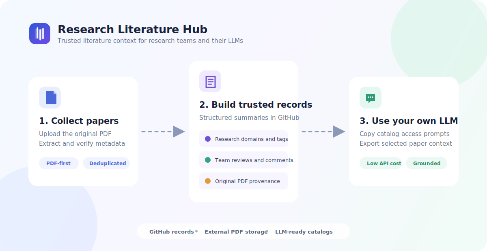
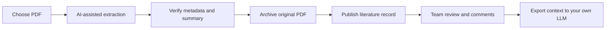

<div align="center">

# Research Literature Hub

### Turn scattered papers into a trusted, team-reviewed knowledge base for your own LLM.

A paper-first literature workflow for research groups: archive PDFs, extract structured
records, organize by research domain, collect team reviews, and export grounded context
to ChatGPT, Claude, Gemini, Kimi, or another external LLM.

[**Live App**](https://research-literature-hub.vercel.app) ·
[**Documentation**](docs/DEPLOYMENT.md) ·
[**中文说明**](README.zh-CN.md)

[](https://github.com/yzyzieee/Research-Literature-Hub/actions/workflows/maintain.yml)
[](LICENSE)
[](webapp)
[](webapp)
[](scripts)
[](docs/DEPLOYMENT.md)

</div>



> [!NOTE]
> The hosted app is the maintainer's team deployment. Fork this repository and connect
> your own GitHub repository, storage, and optional LLM provider to run an independent hub.

## What problem does it solve?

Research groups often keep PDFs, reading notes, ratings, and useful discussion in
different personal drives and chat histories. The result is duplicated reading,
untraceable conclusions, and poor context when a member starts a new LLM conversation.

Research Literature Hub gives the group one durable workflow:

| Collect | Review | Reuse |
|---|---|---|
| Upload the original PDF and extract structured metadata. | Let members score recommendation, innovation, and rigor, then add attributed comments. | Give each member's own LLM a compact catalog or selected-paper context pack. |

The web app is an **LLM context provider**, not another AI chat product. Your team keeps
using its existing LLM subscriptions while the hub supplies reliable internal context.

## Core workflow



1. Choose a PDF. Extraction starts only when the user explicitly requests it.
2. Verify title, authors, venue, DOI, citation key, domains, tags, and summary.
3. Archive the original PDF in external storage with a normalized filename.
4. Publish the Markdown literature record to GitHub.
5. Team members review papers from their own research-domain queue.
6. Export a library prompt, compact catalog, or selected full-record pack.

## Features

| Area | Included |
|---|---|
| **Paper intake** | PDF-first upload, optional LLM extraction, DOI metadata, explicit confirmation |
| **Organization** | One primary domain, multiple cross-domains, technical tags, publication type |
| **Deduplication** | DOI, citation key, normalized title, and Drive metadata checks |
| **Knowledge records** | Problem, method, key results, strengths, limitations, relevance, and notes |
| **Team workflow** | Named accounts, self-managed research domains, reviews, comments, and activity history |
| **Original files** | Configurable Google Drive storage, normalized filenames, and download links |
| **LLM context** | Markdown/JSON catalog, browsing prompt, compact pack, and selected full-record pack |
| **Interface** | English/Chinese UI with standardized English academic metadata |
| **Data ownership** | GitHub Markdown records are the source of truth; no separate application database |

## Use it with your own LLM

The hub avoids paying for an embedded chatbot on every research question.

### 1. Repository access prompt

For browsing-capable LLMs. Point the model to
[`index/llm_catalog.md`](index/llm_catalog.md), retrieve candidates first, and open only
the most relevant records.

### 2. Compact catalog pack

For LLMs that cannot reliably access GitHub. Copy filtered metadata, team weight,
one-line summaries, tags, and record links into the conversation.

### 3. Selected full-record pack

For deeper discussion after initial retrieval. Export a small set with structured
summaries, reviews, comments, record URLs, and available PDF links.

See [Using the Hub with an LLM](docs/LLM_USAGE.md).

## Architecture

```text
Next.js web app
    |
    +-- GitHub repository
    |     +-- official/    published literature records
    |     +-- team/        team account configuration
    |     +-- index/       generated search and LLM catalogs
    |     +-- bib/         merged bibliography
    |
    +-- External PDF storage
    |     +-- Google Drive adapter included
    |
    +-- Optional LLM provider
          +-- metadata and structured-record drafting
```

Markdown literature records remain the source of truth. GitHub Actions validate records,
scan tracked files for common secrets, rebuild indexes, merge bibliography data, and
update the application version.

## Quick start

Requirements:

- Node.js 20+
- Python 3.12+
- A GitHub repository for published records

```bash
git clone https://github.com/yzyzieee/Research-Literature-Hub.git
cd Research-Literature-Hub/webapp
npm install
copy .env.example .env.local
npm run dev
```

Open `http://localhost:3000`. The public records can be browsed locally without Drive or
LLM credentials; publishing and team collaboration require GitHub configuration.

## Configuration

Use [`webapp/.env.example`](webapp/.env.example) as the complete template.

| Variable | Purpose |
|---|---|
| `AUTH_SECRET` | Signs team login session cookies |
| `GITHUB_TOKEN` | Fine-grained token with repository Contents read/write |
| `GITHUB_REPO` | Target repository in `owner/repository` form |
| `NEXT_PUBLIC_GITHUB_REPO` | Repository used for public record and catalog links |
| `LLM_PROVIDER` | Optional extraction provider |
| Provider API key | Server-only key matching the selected provider |
| `DRIVE_FOLDER_ID` | Google Drive folder used by the included storage adapter |
| Google OAuth/service-account variables | Server-side Drive authorization |

Never commit `.env.local`, OAuth tokens, service-account JSON, API keys, or PDF files.

For a complete Vercel setup, see [Deployment](docs/DEPLOYMENT.md).

## Repository layout

```text
official/       Published literature records
index/          Generated indexes and LLM catalogs
bib/            Shared and personal BibTeX sources
team/           Team account registry
webapp/         Next.js application
scripts/        Validation, indexing, promotion, and bibliography tools
docs/           Deployment, schema, LLM usage, and content policy
examples/       Example literature record
```

## Validation

```bash
pip install -r scripts/requirements.txt
python scripts/check_secrets.py
python scripts/check_cards.py
python scripts/update_index.py
python scripts/merge_bibtex.py
cd webapp
npm run build
```

## Project policy

This is a maintainer-controlled open-source project published for transparency,
self-hosting, and reuse. It is not an invitation to modify the maintainer's hosted
library, team registry, or deployment. Users with different workflows should fork the
software and operate their own repository and storage.

- [Literature record specification](docs/LITERATURE_RECORD_SPEC.md)
- [Security policy](SECURITY.md)
- [Copyright and content policy](docs/COPYRIGHT_AND_CONTENT_POLICY.md)
- [MIT License](LICENSE) and [third-party notice](NOTICE)
