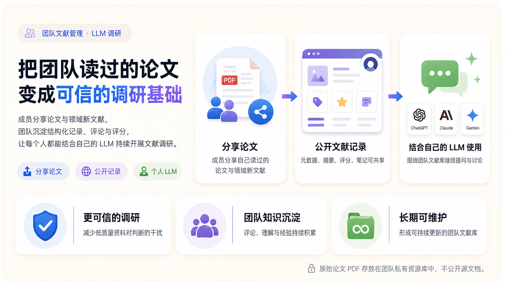
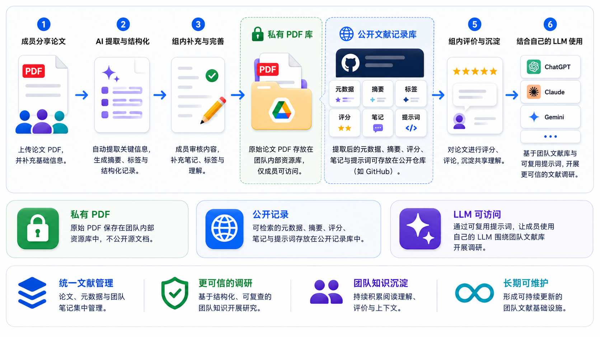

<div align="center">

# Research Literature Hub

### 把团队读过的论文变成可信的调研基础。

一个以论文为核心的研究组工作流：归档 PDF 原文、建立结构化文献记录、沉淀团队判断，
并让每位成员继续使用自己的 LLM 开展调研。

[**在线应用**](https://research-literature-hub.vercel.app) ·
[**Guest 体验**](https://research-literature-hub.vercel.app/login) ·
[**部署指南**](docs/DEPLOYMENT.md) ·
[**English →**](README.md)

[](https://github.com/yzyzieee/Research-Literature-Hub/actions/workflows/maintain.yml)
[](LICENSE)
[](webapp)
[](webapp)
[](scripts)
[](docs/DEPLOYMENT.md)

</div>



> [!TIP]
> 打开在线应用并选择 **以 Guest 身份体验**，即可试用论文导入、AI 提取、原文归档、
> 发布、评分和评论流程。Guest 操作只在当前体验中模拟，不会调用已配置的 LLM，
> 也不会写入 GitHub、Google Drive 或团队账号数据。

## 为什么需要它

研究组的论文、阅读笔记、评分和讨论通常散落在个人文件夹、聊天记录和一次性的 LLM
对话中。结果往往是重复阅读、重要判断无法追溯，以及每次新调研都要重新提供上下文。

Research Literature Hub 提供一条可持续的组内工作流：

| 分享论文 | 建立可信记录 | 结合个人 LLM 复用 |
|---|---|---|
| 上传成员已经读过或刚发现的论文。 | 提取元数据和摘要，再由成员补充标签、评分、评论与判断。 | 将目录、可复用提示词或选中文献包交给 ChatGPT、Claude、Gemini、Kimi 等外部 LLM。 |

WebApp 是一个 **LLM 上下文提供器**，不是另一个聊天机器人。团队维护可靠的文献上下文，
成员继续使用自己已有的 LLM 订阅。

## 两个存储地址

系统有意把原始文件和公开知识记录分为两个层级：

| 层级 | 推荐服务 | 保存内容 | 访问方式 |
|---|---|---|---|
| **团队文件存储** | 共享 Google Drive 文件夹 | 使用统一文件名保存的论文 PDF 原文和已确认的关键图示缓存 | 私有或仅团队成员可访问 |
| **公开记录存储** | Public GitHub Repository | 元数据、摘要、标签、评分、评论、轻量图示引用、索引、提示词和 PDF 引用 | 公开、可追踪版本、便于 LLM 读取 |

Google Drive 是原始文档仓库，GitHub 是可搜索的知识与审计层，Vercel 承载连接两者的界面。

> [!IMPORTANT]
> 写入公开文献记录的 Drive URL 本身也是公开信息，即使对应文件仍需要权限。请根据团队的
> 版权和访问政策配置文件分享权限。

## 核心工作流



1. 成员上传论文 PDF，并补充基础信息。
2. 可选的 AI 提取生成元数据、摘要、研究领域和技术标签草稿。
3. 成员核对并完善结构化文献记录。
4. PDF 原文进入团队私有存储，结构化文献记录进入公开 GitHub 仓库。
5. 团队评分与带署名评论持续沉淀共享判断。
6. 成员使用目录和可复用提示词，把组内文献上下文交给自己的外部 LLM。

两个存储分支通过 DOI、citation key、统一文件名、Drive metadata、来源记录和文献卡中的
PDF 引用保持关联。

## 主要功能

| 模块 | 已包含功能 |
|---|---|
| **论文导入** | 明确选择 PDF、可选 LLM 提取、DOI 元数据和人工确认 |
| **学术组织** | 主领域、交叉领域、publication type、venue、year 和技术标签 |
| **文献去重** | DOI、citation key、标准化标题和 Drive metadata 检查 |
| **结构化记录** | Summary、Problem、Method、Key results、Strengths、Limitations、Relevance 和 Notes |
| **关键图示** | AI 可选推荐、浏览器裁剪与人工确认、私有图片缓存和文献卡缩略预览 |
| **团队知识** | 具名账号、研究方向、多人卡片编辑、推荐度/创新性/严谨性评分、评论和活动历史 |
| **记录治理** | 创建者/管理员直接删除、成员附理由申请删除、管理员审批 |
| **原文管理** | Google Drive 适配器、全局统一文件名、归档来源和下载链接 |
| **LLM 上下文** | Markdown/JSON 目录、仓库访问 Prompt、紧凑目录包和选中文献完整记录包 |
| **界面语言** | 中英文界面，学术元数据统一使用标准英文 |
| **数据所有权** | GitHub Markdown 文献记录是唯一数据源，不依赖独立应用数据库 |

## 配合自己的 LLM 使用

**Use with My LLM** 页面提供三种上下文出口：

1. **仓库访问 Prompt**：适合能联网的 LLM。模型从
   [`index/llm_catalog.md`](index/llm_catalog.md) 开始检索，只打开相关记录。
2. **紧凑目录包**：适合无法稳定访问 GitHub 的模型，包含可搜索元数据、团队权重、
   一句话摘要、标签和记录链接。
3. **选中文献完整记录包**：适合初筛后的深入讨论，包含少量结构化记录、评分、评论和
   可用的 PDF 引用。

这样可以把日常调研成本留在成员自己的 LLM 订阅中，而不是每次提问都消耗团队 API。
更多说明见[如何配合 LLM 使用](docs/LLM_USAGE.md)。

## 系统架构

```text
                         Research Literature Hub（Vercel）
                         /                              \
                        /                                \
       私有文件存储（Google Drive）              公开记录存储（GitHub）
       - PDF 原文                                - 结构化 Markdown 文献记录
       - 全局统一文件名                           - 团队评分与评论
       - 团队控制访问权限                         - 自动生成的索引与 LLM 目录
       - 文件去重 metadata                        - PDF 引用和来源记录
                                                        |
                                                        v
                                                成员自己的外部 LLM
```

GitHub Actions 会检查文献记录和常见密钥泄露、合并 BibTeX、重建索引与 LLM 目录，
并自动更新应用版本。

## 本地运行

环境要求：

- Node.js 20+
- Python 3.12+
- 一个保存记录和生成目录的 GitHub 仓库
- 可选的 Google Drive 存储和 LLM 服务配置

```bash
git clone https://github.com/yzyzieee/Research-Literature-Hub.git
cd Research-Literature-Hub/webapp
npm install
copy .env.example .env.local
npm run dev
```

打开 `http://localhost:3000`。Guest 模式和公开记录浏览不需要写入凭据；持久化发布和
团队协作需要配置 GitHub。

## 环境变量

完整模板见 [`webapp/.env.example`](webapp/.env.example)。

| 变量 | 用途 |
|---|---|
| `AUTH_SECRET` | 签名团队登录 Session Cookie |
| `GITHUB_TOKEN` | 拥有仓库 Contents 读写权限的 fine-grained token |
| `GITHUB_REPO` | `owner/repository` 格式的写入目标 |
| `NEXT_PUBLIC_GITHUB_REPO` | 公开文献记录和目录链接使用的仓库 |
| `LLM_PROVIDER` | 选择元数据与摘要提取服务，例如 `gemini`、`deepseek`、`openai` 或 `anthropic` |
| `GEMINI_API_KEY` / `DEEPSEEK_API_KEY` / `OPENAI_API_KEY` / `ANTHROPIC_API_KEY` | 与 `LLM_PROVIDER` 对应的大模型 API Key，只在服务端使用 |
| `GEMINI_MODEL` / `DEEPSEEK_MODEL` / `OPENAI_MODEL` / `ANTHROPIC_MODEL` | 对应服务商的模型名称 |
| `DRIVE_FOLDER_ID` | Google Drive 原文仓库文件夹 |
| `GOOGLE_OAUTH_CLIENT_ID` / `GOOGLE_OAUTH_CLIENT_SECRET` / `GOOGLE_OAUTH_REFRESH_TOKEN` | 使用个人或 Workspace Drive 时的 OAuth 服务端授权 |
| `GOOGLE_SERVICE_ACCOUNT_KEY` | 使用服务账号时的一行 JSON 凭据 |

例如使用 Gemini：

```text
LLM_PROVIDER=gemini
GEMINI_API_KEY=your-api-key
GEMINI_MODEL=gemini-2.5-flash-lite
```

如果改用 DeepSeek，则设置 `LLM_PROVIDER=deepseek`，并填写
`DEEPSEEK_API_KEY` 与 `DEEPSEEK_MODEL`。只需要配置当前服务商对应的一组 API 变量。

不要提交 `.env.local`、OAuth Token、服务账号 JSON、API Key 或论文 PDF。
完整配置见[部署指南](docs/DEPLOYMENT.md)。

## 仓库结构

```text
official/       已发布的文献记录
index/          自动生成的索引与 LLM 目录
bib/            共享和个人 BibTeX 来源
team/           团队账号与卡片删除申请登记
webapp/         Next.js 应用
scripts/        检查、索引、发布和参考文献工具
docs/           部署、Schema、LLM 用法与内容政策
examples/       文献记录示例
```

## 本地检查

```bash
pip install -r scripts/requirements.txt
python scripts/check_secrets.py
python scripts/check_cards.py
python scripts/update_index.py
python scripts/merge_bibtex.py
cd webapp
npm run build
```

## 项目政策

这是一个由维护者控制的开源项目，公开目的是便于了解、自行部署和复用，并不代表邀请
外部人员修改维护者正在使用的文献库、团队账号或线上部署。需要不同工作流的用户应 Fork
项目，并运行自己的仓库与存储配置。

- [文献记录规范](docs/LITERATURE_RECORD_SPEC.md)
- [安全政策](SECURITY.md)
- [版权与内容政策](docs/COPYRIGHT_AND_CONTENT_POLICY.md)
- [MIT License](LICENSE) 与[第三方内容声明](NOTICE)
