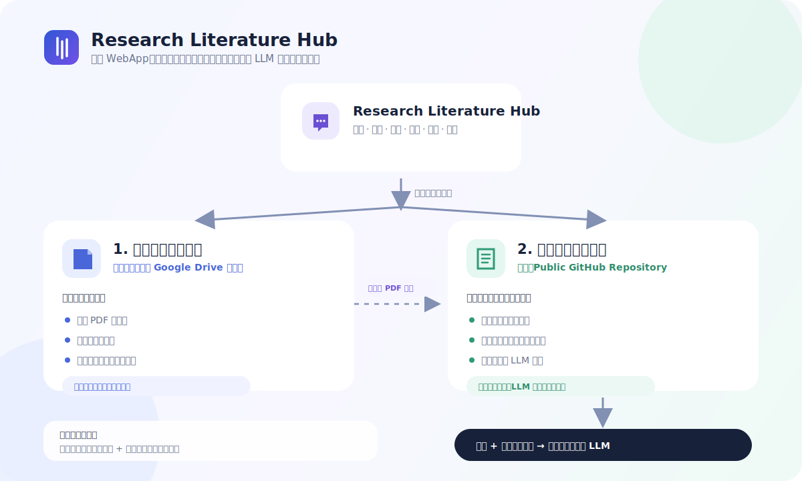
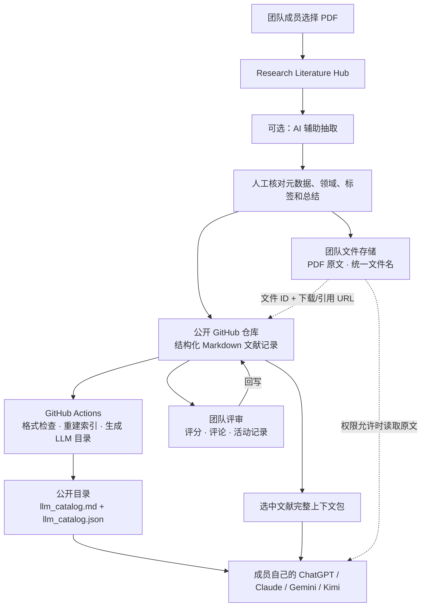

<div align="center">

# Research Literature Hub

### 把分散的论文变成可信、可协作评审、可交给个人 LLM 使用的组内知识库。

一个以论文为核心的研究组文献工作流：归档 PDF、抽取结构化阅读记录、按研究方向
组织、汇集团队评审，并把可靠上下文导出给 ChatGPT、Claude、Gemini、Kimi
或其他外部 LLM。

[**在线应用**](https://research-literature-hub.vercel.app) ·
[**部署文档**](docs/DEPLOYMENT.md) ·
[**切换到 English →**](README.md)

[](https://github.com/yzyzieee/Research-Literature-Hub/actions/workflows/maintain.yml)
[](LICENSE)
[](webapp)
[](webapp)
[](scripts)
[](docs/DEPLOYMENT.md)

</div>



> [!NOTE]
> 在线应用是维护者团队正在使用的部署实例。若要建立独立知识库，请 Fork 本仓库，
> 并连接你自己的 GitHub 仓库、PDF 存储和可选 LLM 服务。

## 它解决什么问题？

研究组的 PDF、阅读笔记、评分和讨论经常散落在个人网盘与聊天记录中，最终造成重复
阅读、结论无法追溯，以及每次和 LLM 讨论新想法时都缺少稳定的组内上下文。

Research Literature Hub 提供一条统一且可持续的工作流：

| 收集 | 评审 | 复用 |
|---|---|---|
| 上传原始 PDF，抽取结构化元数据与阅读记录。 | 成员从推荐度、创新性、严谨性三个维度评分，并添加署名评论。 | 把紧凑目录或选中文献上下文交给每位成员自己的 LLM。 |

WebApp 是一个 **LLM 上下文提供器**，而不是另一个 AI 聊天产品。团队继续使用已有
的 LLM 订阅，知识库负责提供可靠、可追溯的内部文献上下文。

## 必须准备两个存储地址

系统连接两个职责不同的数据层，不能把它们混成同一个仓库：

| 存储地址 | 推荐服务 | 保存内容 | 访问方式 |
|---|---|---|---|
| **1. 团队文件存储地址** | 团队共享的 Google Drive 文件夹 | 论文 PDF 原文件 | 由团队控制，可以保持私有或仅向成员共享 |
| **2. 公开总结存储地址** | Public GitHub Repository | 结构化文献记录、评审、评论、索引和 PDF 引用 | 公开、可版本追踪，支持联网 LLM 直接读取 |

GitHub 中只保存 **PDF 的引用和来源信息**，不保存 PDF 文件本身。Google Drive 是
原文仓库，GitHub 是可搜索的知识与审计层，Vercel 部署的 WebApp 负责连接并写入两边。

> [!IMPORTANT]
> 写进公开文献记录的 Drive URL 本身也是公开信息，即使对应文件仍要求权限。请根据
> 团队的版权与访问政策配置 Drive 分享权限。

## 核心流程与数据层



只有人工确认草稿之后，数据才分流到两个层级：

1. **PDF 原文件**进入团队文件存储地址。
2. **结构化总结与元数据**进入公开 GitHub 仓库。
3. 文献记录保存 PDF 引用、来源信息和统一文件名。
4. 团队评分与评论继续回写到公开文献记录。
5. GitHub Actions 自动重建搜索索引和紧凑 LLM 目录。
6. 外部 LLM 先读取目录，再打开少量记录或有权限访问的 PDF。

## 主要功能

| 模块 | 已包含功能 |
|---|---|
| **论文导入** | PDF 优先上传、可选 LLM 抽取、DOI 元数据、人工确认 |
| **学术分类** | 一个主领域、多个交叉领域、技术标签、publication type |
| **文献去重** | DOI、citation key、标准化标题和 Drive metadata 检查 |
| **知识记录** | Problem、Method、Key results、Strengths、Limitations、Relevance、Notes |
| **团队协作** | 成员账号、自选研究方向、评审、署名评论和活动历史 |
| **原文管理** | 可配置 Google Drive、统一文件名、原文下载链接 |
| **LLM 上下文** | Markdown/JSON 目录、联网访问 Prompt、紧凑包、完整记录包 |
| **界面语言** | 中英文界面，学术元数据统一使用标准英文 |
| **数据所有权** | GitHub Markdown 是唯一数据源，应用不维护独立数据库 |

## 配合每个人自己的 LLM 使用

系统不会为了每一次调研都调用内置聊天机器人，因此能够避免重复承担团队 AI API 成本。

### 1. 文献库访问 Prompt

适用于能够联网读取 GitHub 的 LLM。让模型先读取
[`index/llm_catalog.md`](index/llm_catalog.md) 检索候选文献，再打开少量最相关记录。

### 2. 紧凑目录包

适用于不能稳定访问 GitHub 的 LLM。把筛选后的元数据、团队权重、一句话总结、标签和
记录链接直接复制进对话。

### 3. 选中文献完整记录包

适用于初步检索后的深入讨论。导出少量文献的结构化总结、团队评审、评论、记录 URL
和可用 PDF 链接。

更多说明见 [如何配合 LLM 使用](docs/LLM_USAGE.md)。

## 系统架构

```text
                         Research Literature Hub（Vercel）
                         /                              \
                        /                                \
       团队文件存储（Google Drive）             公开总结存储（GitHub）
       - PDF 原文件                              - 结构化 Markdown 文献记录
       - 全局统一文件名                          - 团队评审与评论
       - 团队控制访问权限                        - 自动生成的索引与 LLM 目录
       - 文件去重 metadata                       - PDF 引用和来源信息
                                                        |
                                                        v
                                                成员自己的外部 LLM
```

Markdown 文献记录始终是唯一数据源。GitHub Actions 会检查记录格式与常见密钥泄露、
重建索引、合并 BibTeX，并自动更新应用版本。

## 本地运行

环境要求：

- Node.js 20+
- Python 3.12+
- 一个保存 PDF 原文的团队共享文件地址
- 一个保存总结和生成目录的 Public GitHub Repository

```bash
git clone https://github.com/yzyzieee/Research-Literature-Hub.git
cd Research-Literature-Hub/webapp
npm install
copy .env.example .env.local
npm run dev
```

打开 `http://localhost:3000`。没有 Drive 或 LLM 密钥时仍可在本地浏览公开记录；
发布文献和团队协作功能需要配置 GitHub。

## 环境变量

完整模板见 [`webapp/.env.example`](webapp/.env.example)。

| 变量 | 用途 |
|---|---|
| `AUTH_SECRET` | 签名团队登录 Session Cookie |
| `GITHUB_TOKEN` | 仅限目标仓库、拥有 Contents 读写权限的 fine-grained token |
| `GITHUB_REPO` | `owner/repository` 格式的目标仓库 |
| `NEXT_PUBLIC_GITHUB_REPO` | 文献记录和 LLM 目录公开链接使用的仓库 |
| `LLM_PROVIDER` | 可选的抽取服务商 |
| 对应服务商 API Key | 仅服务端使用的抽取密钥 |
| `DRIVE_FOLDER_ID` | Google Drive 原文仓库文件夹 |
| Google OAuth/服务账号变量 | Drive 服务端授权 |

不要提交 `.env.local`、OAuth Token、服务账号 JSON、API Key 或论文 PDF。

完整 Vercel 部署步骤见 [部署指南](docs/DEPLOYMENT.md)。

## 仓库结构

```text
official/       已发布的文献记录
index/          自动生成的索引与 LLM 目录
bib/            共享和个人 BibTeX 来源
team/           团队账号登记
webapp/         Next.js 应用
scripts/        检查、索引、发布和参考文献工具
docs/           部署、Schema、LLM 用法与内容政策
examples/       文献记录示例
```

## 本地检查

```bash
pip install -r scripts/requirements.txt
python scripts/check_secrets.py
python scripts/check_cards.py
python scripts/update_index.py
python scripts/merge_bibtex.py
cd webapp
npm run build
```

## 项目政策

这是一个由维护者控制的开源项目，公开目的是便于了解、复用和自行部署，并不代表邀请
外部人员修改维护者正在使用的文献库、团队账号或线上部署。需要不同工作流的用户应当
Fork 项目，并运行自己的仓库与存储配置。

- [文献记录规范](docs/LITERATURE_RECORD_SPEC.md)
- [安全政策](SECURITY.md)
- [版权与内容政策](docs/COPYRIGHT_AND_CONTENT_POLICY.md)
- [MIT License](LICENSE) 与 [第三方内容声明](NOTICE)
